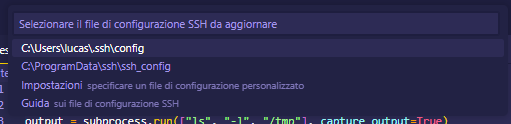
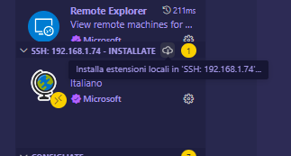
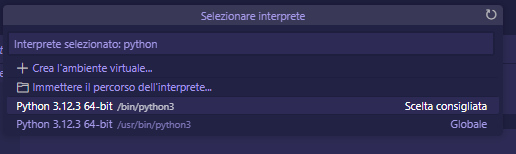

# Beginner Python for SOC crash course

Questo repository contiene il materiale utilizzato per il corso accelerato di Python SOC il 14/11/2024.

> [!WARNING]
> Questo non deve in alcun modo essere preso come un approccio serio alla CyberSecurity, ma piuttosto come un'*introduzione per principianti* al **potenziale** rappresentato dal conoscere Python in un contesto SOC.

## Obbiettivi

> [!NOTE] Modulo 6 – Automazione con Python (1 giorno)
> Giorno 23: Automazione di Task Ripetitivi con Python
> - Mattina:
>   - Introduzione a Python per l'Automazione:
>     - Panoramica sulla sintassi di base di Python.
>     - Introduzione ai tipi di dati fondamentali (stringhe, numeri, liste, dizionari).
>     - Configurazione dell'ambiente di sviluppo (IDE) e installazione delle librerie necessarie.
>   - Lettura e Manipolazione di File:
>     - Lettura di file CSV, JSON e log.
>     - Utilizzo delle librerie csv, json e os per estrarre e manipolare dati.
>     - Esercitazioni pratiche sulla lettura e la scrittura di file.
> - Pomeriggio:
>   - Automazione di Task Ripetitivi:
>     - Utilizzo delle librerie os, sys e subprocess per automatizzare task come l'esecuzione di comandi di sistema e la gestione di file.
>     - Creazione di script per il monitoraggio dei log di sistema.
>     - Automazione di task comuni come il backup di file, l'invio di email con risultati di script e la gestione di processi.
>   - Esempi Pratici di Automazione:
>     - Sviluppo di uno script per automatizzare il controllo e il monitoraggio di cartelle specifiche in un ambiente SOC.
>     - Utilizzo di script per automatizzare operazioni ripetitive come la scansione di file di log e l'invio di alert.
>
> Obiettivi del Modulo: Il modulo "Automazione con Python" fornisce ai partecipanti le competenze base per
> automatizzare task ripetitivi utilizzando Python. Verranno trattati i concetti fondamentali di lettura e
> manipolazione dei file e la gestione dei processi di sistema, permettendo ai partecipanti di sviluppare script
> utili in un contesto SOC per ottimizzare le operazioni quotidiane.

1. Analizza e genera un report per le seguenti vulnerabilità:
   - porte aperte (`lsof -i`)
   - troppi tentativi di accesso (`lastb --fullnames --time-format iso --dns`)
   - utenze bloccate/scadute
2. Lettura di un file CSV contenente una lista di hostname/porta e controllare che siano aperte

## Connessione al server

1. Installa le estensioni consigliate, in particolare:
   - [Python](https://marketplace.visualstudio.com/items?itemName=ms-python.python)
   - [Pylance](https://marketplace.visualstudio.com/items?itemName=ms-python.vscode-pylance)
   - [Remote - SSH](https://marketplace.visualstudio.com/items?itemName=ms-vscode-remote.remote-ssh)
   - [Tabstop Whitespace Converter](https://marketplace.visualstudio.com/items?itemName=johnnywong.vscode-ts-whitespace-converter)

2. Installa un client OpenSSH:
   - [Git for Windows](https://git-scm.com/downloads/win)
   - [Windows OpenSSH Client](https://learn.microsoft.com/it-it/windows-server/administration/openssh/openssh_install_firstuse?tabs=gui&pivots=windows-server-2019#install-openssh-for-windows-server)

3. Aggiungi il server alla lista di host:
   1. Apri il "Riquadro Comandi" (<kbd>Ctrl</kbd>+<kbd>Shift</kbd>+<kbd>A</kbd> o <kbd>Ctrl</kbd>+<kbd>Shift</kbd>+<kbd>P</kbd> a seconda dei binding)
   2. Digita "Remote-SSH: Add new SSH Host" e dai <kbd>Invio</kbd>
   3. Quando richiesto inserisci la seguente stringa sostituendo a `SERVER_USERNAME` e `SERVER_IP` i valori corretti:
      ```shell
      ssh -o UserKnownHostsFile=/dev/null -o StrictHostKeyChecking=no {SERVER_USERNAME}@{SERVER_IP} -p 2222
      ```
   4. Seleziona il file di configurazione nella tua home:
      

4. Connettiti all'host remoto:
   1. Apri il "Riquadro Comandi" (<kbd>Ctrl</kbd>+<kbd>Shift</kbd>+<kbd>A</kbd> o <kbd>Ctrl</kbd>+<kbd>Shift</kbd>+<kbd>P</kbd> a seconda dei binding)
   2. Digita "Remote-SSH: Connetti la finestra corrente all'host..." e dai <kbd>Invio</kbd>
   3. Seleziona l'host creato al punto 3 (con il nome corrispondente a `SERVER_IP`)
   4. Inserisci la password

5. Installa nell'host remoto le estensioni locali:
   1. Clicca sul tasto "Estensioni" dalla barra laterale sinistra
   2. Clicca al pulsante download alla destra della sezione "SSH - {ip_address} - INSTALLATE"
   

6. Seleziona l'interprete Python remoto:
   1. Apri il "Riquadro Comandi" (<kbd>Ctrl</kbd>+<kbd>Shift</kbd>+<kbd>A</kbd> o <kbd>Ctrl</kbd>+<kbd>Shift</kbd>+<kbd>P</kbd> a seconda dei binding)
   2. Digita "Python: Select Interpreter" e dai <kbd>Invio</kbd>
   3. Seleziona "Python 3.12.3" come da immagine:
   

7. Sei pronto!